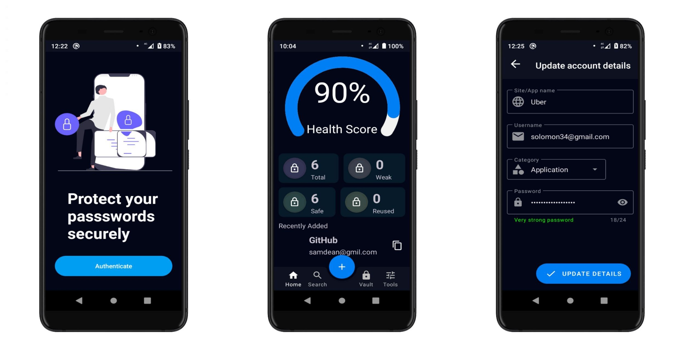
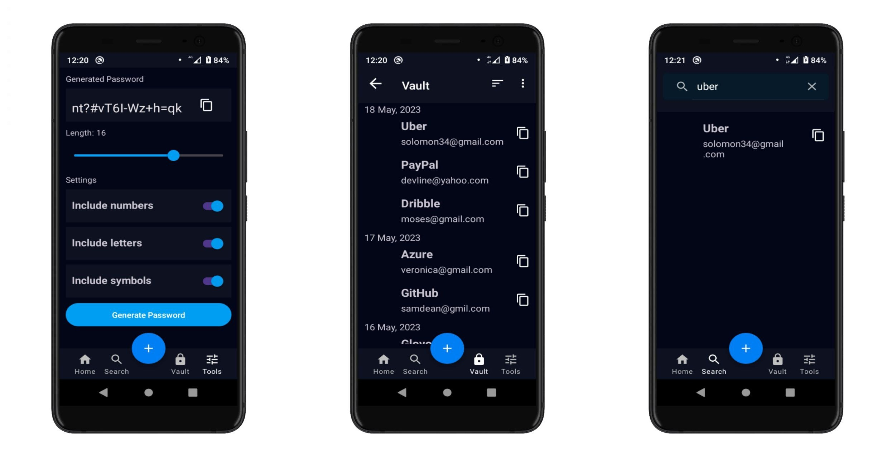

# SafePass
This is a password manager app developed in Kotlin for Android using the MVVM architecture. The app allows users to securely store their passwords and other sensitive information. It uses a Room database to persist the passwords, ViewModels to manage the data, Kotlin Flows and Coroutines for asynchronous tasks, and the Android Navigation Component to manage the app's navigation.

## Features
  - Save and manage your passwords securely
  - Automatic logout when the app is in the background
  - Secure password generation
  - Biometrics Login

## Screenshots

## TechStacks
  - [**Kotlin Flows and Coroutines**](https://kotlinlang.org/docs/reference/coroutines-overview.html)
    Kotlin Flows and Coroutines are used to perform asynchronous tasks in the app, such as querying the database or encrypting and decrypting data. Kotlin Flows are a new addition to the Kotlin language that allow developers to build reactive streams of data, while Coroutines are a lightweight way to perform asynchronous tasks.
  - [**Android Navigation Component**](https://developer.android.com/guide/navigation)
    The Android Navigation Component is a framework that helps developers manage the navigation of their app. It provides a way to define the different screens in the app and the actions that can be taken to move between them, as well as handling the back stack and saving the state of the app.
  - [**LiveData**](https://developer.android.com/topic/libraries/architecture/livedata)
  The app uses LiveData, which is a part of the Android Architecture Components, to handle data in a lifecycle-aware manner. LiveData is an observable data holder class, which means that it can notify views when the data it holds changes. In this way, the app can update the UI in response to changes in the data, without having to worry about handling lifecycle events manually.
  - [**Biometrics Authentication**](https://developer.android.com/training/sign-in/biometric-auth)
  The app uses Biometrics Authentication to securely login to the app using the fingerprint scanner or face recognition. The app uses the androidx Biometric library to handle biometrics authentication.
  - [**ViewModels**](https://developer.android.com/topic/libraries/architecture/viewmodel)
  The app uses ViewModels to manage UI-related data and handle logic that is specific to the UI. ViewModels are designed to survive configuration changes (such as screen rotations) and to be shared between multiple fragments or activities. In this app, the ViewModels are implemented using the Android ViewModel class, which is part of the Android Architecture Components.
  - [**Truth Library**](https://github.com/google/truth)
  The Truth library is a set of Java and Android libraries for asserting the truth of expressions, and providing failure messages that are easy to understand and debug. It provides a concise and expressive syntax for creating and combining matchers, which can be used to match the properties of an object. In this way, Truth can be used to write expressive and robust tests for an Android app, making it easier to verify that the app is functioning as expected
  
## Future Updates  
   - Adding a backup server
   - Password encryption

## Contributions
We welcome contributions to this project. If you have any suggestions or want to report a bug, please open an issue or submit a pull request.
